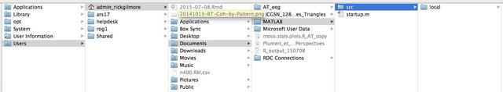
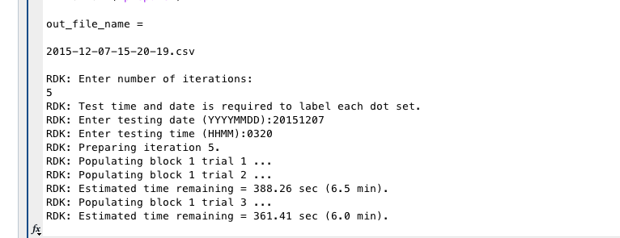
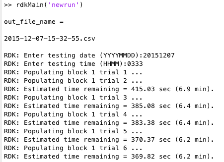
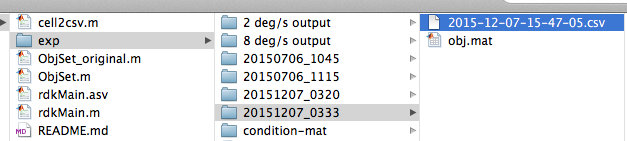
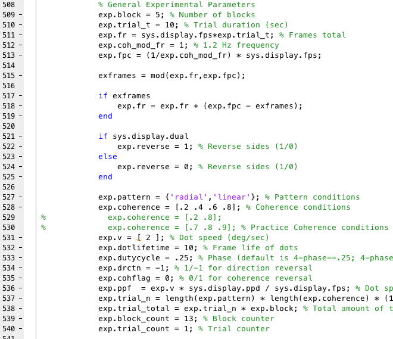

# MOCO 3 Pattern Psychophysics Checklist

Authors: William Adamiak & Rick O. Gilmore (rick.o.gilmore@gmail.com)
Date: 2015-04-24

Updated:  
Andrea Seisler 2015-12-07 Add instructions  
Andrea Seisler 2015-12-15 Add Images

## Startup

-  Use Mac in room 449A Moore
-  Log in to Admin Rick Gilmore account with password imac1234%
-  Make sure connected to psu Wifi
-  Open MATLAB by clicking on the logo on bottom toolbar (**Matlab_R2013b**)  

-  Enter command: rdkMain(‘oldload’)  
The following should come up:

  

-  Navigate to:

-   To change parameters: select an obj.mat file from a participant folder in the exp folder (see below).

-   rdkMain is the primary function for this experiment that accepts one argument. To execute it, enter in the Matlab command window. The syntax for running the command is: rdkMain(‘argument’). The argument value must be contained in single quotes.

-   rdkMain allows for 3 options to pass as an argument. They are:
	- ’prepare’, to make new stimuli
	- ‘newrun’, to run a new pattern on the fly
	- ‘oldload’, to load pre-generated stimuli.

## Prepare

- Below is an example command window during ‘prepare’.
- RDK will ask for the number of iterations (any numeric value), testing date (YYYYMMDD), and testing time (HHMM).
- The command window will then show a report of block/trial completed and a countdown of how much longer that trial will take to complete.
- Prior to each iteration of dot generation, RDK will request a new testing date/time for that dot set.
- Note that this option does not present dots in any way. It simply “prepares” dots for future use. The files generated are Matlab data structures containing (among other items) bitmaps of the two dot display regions for each frame in the movie.

- The resulting file is created in the folder: /Users/admin_rickgilmore/Documents/MATLAB/src/local/exec/RDK/exp/YYYYMMDD_HHMM/obj.mat

## New run

- During ‘newrun’, one iteration of dots is created and the display sequence begins immediately after.
- As such, testing date and time will be requested upon script execution.
- See below for presentation format.
- This is useful for seeing the effects of particular parameters.
- The resulting file is created in the folder: /Users/admin_rickgilmore/Documents/MATLAB/src/local/exec/RDK/exp/YYYYMMDD_HHMM/obj.mat

## Old load

- For rdkMain(‘oldload’), select an **obj.mat** file within the ./exp/generated_study_folder.

- The ‘oldload’ option ignores dot generation entirely, and assumes that a dot set has already been pre-generated (obj.mat).

- As such, ‘oldload’ will start dot presentation as soon as an obj.mat is selected.

Enter command: rdkMain(‘oldload’)  
The following should come up:

  

Navigate to:

Choose which input device will be used for the experiment.  

## Presentation format

- Participants should be seated 60 cm from the monitor
- Participant Instructions:   
    - Fixate on the dot in the center of the display and to use your peripheral vision to determine which of the displays exhibits an optic flow pattern.
    - There is a 10 second response time limit
    - We will take a break half way through the study.
1. Participant will see welcome screen
2. Next PsychToolbox screen will show briefly
3. A blank screen will appear
4. Press **spkey** to begin
5. Press **spkey** again to bring up fixation point
6. Press **spkey** once more to bring up side-by-side circular dot displays
7. Choose which display is exhibiting motion coherence by pressing the **lkey** for the left or the **rkey** key for the right
8. Repeat steps 4-7 until the program ends

## Response Keys
|code name| keyboard    | USB 12 button gamepad| Description            | 
|---------|-------------|----------------------|------------------------| 
| spkey   | space bar   | 6 button             |Progress to next screen |  
| esckey  | esc         | 4 button             |Abort display sequence  |  
| pkey    | P           | 5 button             |Go to previous trial    | 
| lkey    | Z           | Left Front 2 button  |Left Response           |
| rkey    | ?/          | Right Front 2 button |Right Response          |

## End of session

- After experiment is complete, an YYYY-MM-DD-HH-MM-SS.csv is created in the Experimental Condition folder.

- Select the YYYY-MM_DD-HH-MM-SS.csv file to view participant performance (Ctrl+Click \>\> Select *Open Outside Matlab*)

- Rename this file with session date, participant ID, velocity (2 or 8), and run number information (1-4) (e.g. YYMMDDSSSS-2deg1.csv). This should be renamed before the next run starts. There will be 4 files total for each participant.

Adult Sessions

- Session files are stored on ~/Box Sync/gilmore-lab/projects/optic-flow/optic-flow-psychophysics/projects/moco-3-pattern-psychophysics/adult-laminar-radial/data in a directory with the session test date and a 3 digit participant number (YY-MM-DD-SSS).

Child Sessions

- Session files are stored on ~/Box Sync/gilmore-lab/projects/optic-flow/optic-flow-psychophysics/projects/moco-3-pattern-psychophysics/child-laminar-radial/data in a directory with the session test date [YYMMDD], a 4 digit participant number [PPPP], Block [1-4], and Speed [2,8] (YYMMDDPPPPBS).

## Data merging, cleaning with RStudio

- An [RStudio](http://www.rstudio.com/) project is located in ~/Box Sync/gilmore-lab/projects/optic-flow/optic-flow-psychophysics/projects/moco-3-pattern-psychophysics/adult-laminar-radial/analysis
- Open RStudio, then navigate to this directory and open the *analyses.Rproj* file or select this project from the menu.
- The *william.R* script can be run. It creates and cleans a merged data file, exports new .csv files to subject directories, conducts statistical analyses, and creates several useful plots.

## Uploading data to Databrary

- The data for this project are shared with Databrary under <http://databrary.org/volume/73>

## Manipulate experimental parameters

-   To view previous experimental parameters, select an obj.mat within a subject folder in the exp/ directory.

- Experiment .m files located at: /Users/admin_rickgilmore/Documents/MATLAB/src/local/exec/RDK
  - rdkMain.m, ObjSet.m, inputDevice.m 

- To manipulate experimental parameters prior to dot generation, open the **ObjSet.m**, and adjust the values below.

    
 
- Highlighted are the parameters that are flexible to change (except exp.fr).

- To manipulate the input keys for responses, open the **inputDevice.m**

    

- Always verify changes with those with experience before saving.

