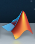
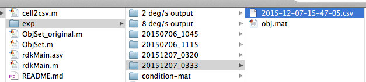

# Protocol for Running MOCO Psychophysics Experiment

Author: Andrea Seisler  
Created: 2015-09-25  
Updated: 2016-01-13 -include instructions for use of USB gamepad  

## Set up Lighting

1. Turn off the overhead light.
2. Turn on the under desk lighting to 100% using the remote control.

## Set up Camera

1. Follow [GoPro](go-pro-instructions.md) procedures to start up the camera and Wifi
2. At the beginning of each block show the number of fingers for the block number
3. Turn camera off at the end of each block
 	



## Set up Computer

1. Use Mac in room 449A Moore
2. Log in to Admin Rick Gilmore account with password imac1234%
3. Make sure connected to psu Wifi
4. Open MATLAB by clicking on the logo on bottom toolbar (**Matlab_R2013b**)  
    
5. Enter command: rdkMain(‘oldload’)  
   The following should come up:   
    
6. Navigate to:  
    
7. Open src->local->exec->RDK->exp->  

    - child_2deg/s_output > obj-2degPs-child.mat   
      - velocity = 2 deg/s  
      - coherence = [.2,.4,.6,.8]  
          
    - child_8deg/s_output > obj-8degPs-child.mat  
      - velocity = 8 deg/s    
      - coherence = [.2,.4,.6,.8]   
         
      
8. Choose which input device will be used for the experiment  

9. Participants should be seated 60 cm from the monitor

10. Participant Instructions (adult):   
    - Fixate on the dot in the center of the display and to use your peripheral vision to determine which of the displays exhibits an optic flow pattern.
    - There is a 10 second response time limit
    - We will take a break half way through the study.  
    Participant Instructions (child):
    - Look at the dot in the middle of the screen
    - Point to the image which is moving up and down or in and out.
11. Participant will see welcome screen
12. Next PsychToolbox screen will show briefly
13. A blank screen will appear
14. Press **spkey** to begin
15. Press **spkey** again to bring up fixation point
16. Press **spkey** once more to bring up side-by-side circular dot displays
17. Choose which display is exhibiting motion coherence by pressing the **lkey** for the left and **rkey** for the right
18. Repeat steps 15-17 until the program ends

### Notes


#### How many Blocks do I run?  
- 1 run = 5 blocks of 16 trials  
- Randomize Blocks - each participant completes one of the presentation patterns below.  

	- 2 8 2 8  
	- 2 8 8 2  
	- 8 2 8 2  
	- 2 2 8 8  
	- 8 8 2 2  
	- 8 2 2 8  
		

Adults: 2 runs of each type    

- 2 deg/s output-adult > obj_2degPSec.mat: 2 deg/sec [.05,.10,.15,.20]  
- 8 deg/s output-adult > obj_8degPSec.mat: 8 deg/sec [.05,.10,.15,.20]  

Children: 2 runs of each type  

- child_2degPs > obj_2degPs_5-8.mat: 2 deg/sec [.15 .30 .45 .60]  - start 5/11/2016
- child_8degPs > obj_8degPs_5-8.mat: 8 deg/sec [.15 .30 .45 .60]  - start 5/11/2016

- child_2_degPs_output > obj-2degPs-child.mat: 2 deg/sec [.2,.4,.6,.8]  - from 1/2016 to 5/10/2016
- child_8_degPs_output > obj-8degPs-child.mat: 8 deg/sec [.2,.4,.6,.8]  - from 1/2016 to 5/10/2016

4 Runs Total

#### Response Keys
|code name| keyboard    | USB 12 button gamepad| Description            | 
|---------|-------------|----------------------|------------------------| 
| spkey   | space bar   | 6 button             |Progress to next screen |  
| esckey  | esc         | 4 button             |Abort display sequence  |  
| pkey    | P           | 5 button             |Go to previous trial    | 
| lkey    | Z           | Left Front 2 button  |Left Response           |
| rkey    | ?/          | Right Front 2 button |Right Response          |


## End of session

#### Adult Sessions

- After experiment is complete, an YYYY-MM-DD-HH-MM-SS.csv is created in the Experimental Condition folder.

- Select the YYYY-MM_DD-HH-MM-SS.csv file to view participant performance (Ctrl+Click \>\> Select *Open Outside Matlab*)

- Rename this file with session date, participant ID, velocity (2 or 8), and run number information (1-4) (e.g. YYMMDDSSSS-2deg1.csv). This should be renamed before the next run starts. There will be 4 files total for each participant.

- Session files are stored on ~/Box Sync/gilmore-lab/projects/optic-flow/optic-flow-psychophysics/projects/moco-3-pattern-psychophysics/adult-laminar-radial/data in a directory with the session test date and a 3 digit participant number (YY-MM-DD-SSS).

#### Child Sessions

- After experiment is complete, an YYMMDDPPPPBS.csv is created in the Experimental Condition folder.

- Session files are stored on ~/Box Sync/gilmore-lab/projects/optic-flow/optic-flow-psychophysics/projects/moco-3-pattern-psychophysics/child-laminar-radial/data in a directory with the session test date(YYMMDD), 4 digit participant number (PPPP), Block(B) and Speed(S): (YYMMDDPPPPBS).


## Uploading data to Databrary

- The adult data for this project are shared with Databrary under <http://databrary.org/volume/73>
- The child data (.mp4 and .csv)for this project are shared with Databrary under <https://nyu.databrary.org/volume/218>

## Uploading to Box  

- Child data are located on [Box](https://psu.app.box.com/files/0/f/9026922610/session-data) at gilmore-lab/projects/optic-flow/optic-flow-psychopyhsics/projects/moco-3-pattern-psychophysics/child-laminar-radial/analysis/session-data

- Child data are also on GitHub in the [moco-3-pattern-psychophysics](https://github.com/gilmore-lab/moco-3-pattern-psychophysics/tree/master/child-laminar-radial/data) repository.

## Data merging, cleaning with RStudio

- An [RStudio](http://www.rstudio.com/) project is located in ~/Box Sync/gilmore-lab/projects/optic-flow/optic-flow-psychophysics/projects/moco-3-pattern-psychophysics/adult-laminar-radial/analysis
- Open RStudio, then navigate to this directory and open the *analyses.Rproj* file or select this project from the menu.
- The *william.R* script can be run. It creates and cleans a merged data file, exports new .csv files to subject directories, conducts statistical analyses, and creates several useful plots.


## Protocol for Retrieving Session Data  
1.	Open Excel  
2.	Open src->local->exec->RDK->exp->20140922_0403  
3.	Enable “All Files” at bottom  
4.	Open ‘out.csv’  
